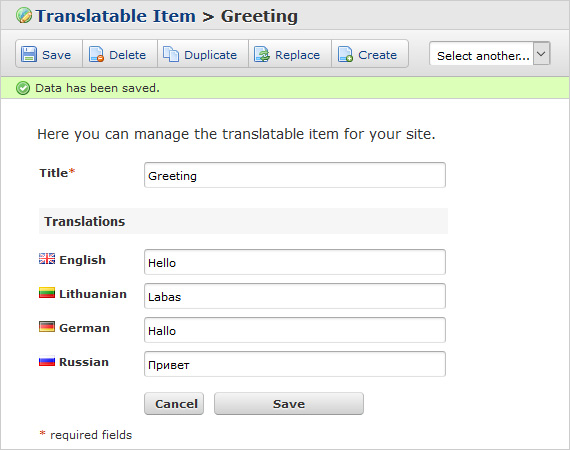

# FUEL CMS Translatable Module

The Translatable Module is a module for the FUEL CMS content management system that allows setting up translatable fields for existing models.

## Installation
There are a couple ways to install the module. If you are using GIT you can use the following method to create a submodule:

### Using Git
1. Open up a Terminal window, "cd" to your FUEL CMS installation then type in: 
``php index.php fuel/installer/add_git_submodule git://github.com/martynassateika/FUEL-CMS-Translatable-Module.git translatable``

2. Then to install, type in:
``php index.php fuel/installer/install translatable``

### Manual
1. Download the zip file from GitHub:
[https://github.com/martynassateika/FUEL-CMS-Translatable-Module](https://github.com/martynassateika/FUEL-CMS-Translatable-Module)

2. Create a "translatable" folder in fuel/modules/ and place the contents of the tester module folder in there.

3. Then to install, open up a Terminal window, "cd" to your FUEL CMS installation and type in:
``php index.php fuel/installer/install translatable``

## Uninstall

To uninstall the module which will remove any permissions and database information:
``php index.php fuel/installer/uninstall translatable``

## Troubleshooting
1. You may need to put in your full path to the "php" interpreter when using the terminal.
2. You must have access to an internet connection to install using GIT.

## Attributions
* The module is built for use with [FUEL CMS](https://github.com/daylightstudio/FUEL-CMS), a framework built by David McReynolds, licenced under [Apache 2](http://www.apache.org/licenses/LICENSE-2.0.html).
* The module uses icons from several icon sets by [FamFamFam](http://www.famfamfam.com/):
  * [FamFamFam Silk Icon Set](http://www.famfamfam.com/lab/icons/silk/) (licenced under a [Creative Commons Attribution 2.5 licence](http://creativecommons.org/licenses/by/2.5/))
  * [Flag Icons Set](http://www.famfamfam.com/lab/icons/flags/).

## Licence
The Translatable module for FUEL CMS is licenced under [Apache 2](http://www.apache.org/licenses/LICENSE-2.0).